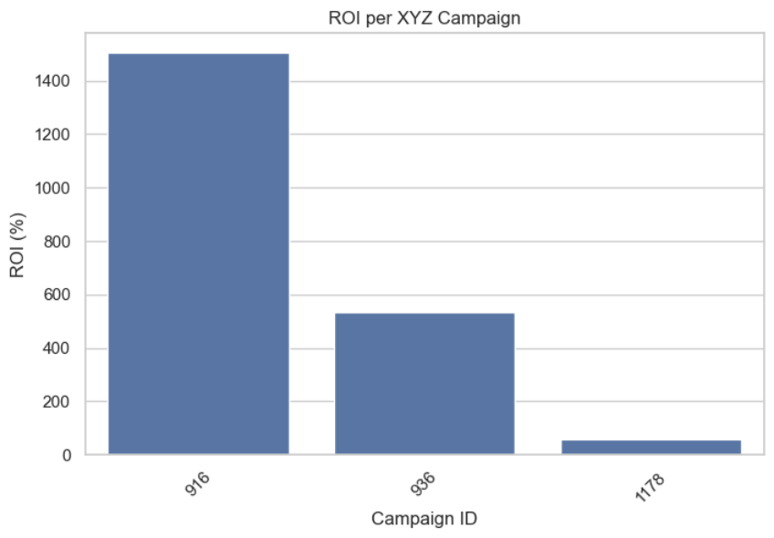
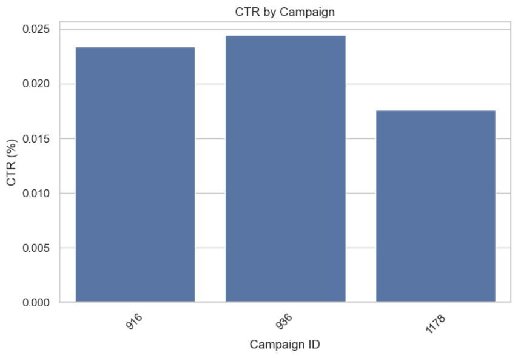
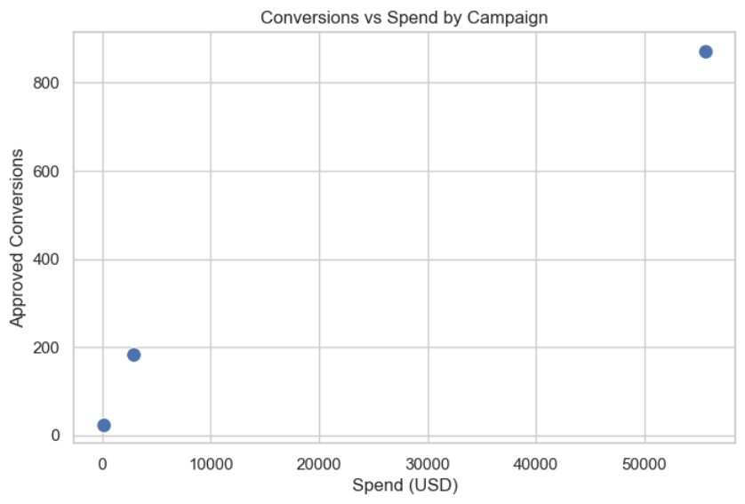

# Marketing Campaign Performance & ROI Optimization Analysis
-Project Overview

This project analyzes a digital marketing dataset to evaluate campaign performance, measure return on investment (ROI), and optimize budget allocation.

Using Python and Pandas, the analysis identifies:

High-performing campaigns

Inefficient spend patterns

Ad-level performance drivers

The goal was to simulate a real-world marketing analytics scenario where revenue data is incomplete and performance must be inferred through calculated metrics.

# Dataset Description

The dataset contains campaign-level and ad-level performance metrics:

Impressions – Number of times the ad was shown

Clicks – Number of clicks received

Spend (USD) – Amount spent on the campaign/ad

Total Conversions – Total conversions generated

Approved Conversions – Verified conversions

Since revenue data was unavailable, a revenue proxy was created by assigning $100 per approved conversion to simulate financial return.

# Key Performance Metrics
Metric	Formula	Business Purpose
CTR (Click-Through Rate)	clicks / impressions × 100	Measures ad engagement effectiveness
Conversion Rate	approved_conversion / clicks × 100	Measures campaign efficiency
ROI	(revenue_estimated − spend) / spend × 100	Measures financial return
Cost per Conversion	spend / approved_conversion	Evaluates cost efficiency
# Analytical Approach
1. Data Cleaning & Standardization

Standardized column names

Converted numeric fields to proper data types

Validated dataset integrity

2. Campaign-Level Aggregation

Grouped by campaign_id

Calculated ROI, CTR, Conversion Rate, and Cost per Conversion

Identified revenue-positive vs revenue-negative campaigns

3. Ad-Level Drill-Down

Grouped by ad_id

Isolated top-performing creatives

Flagged inefficient ads with high spend but low conversions

4. Platform-Level Evaluation

Analyzed fb_campaign_id for platform performance comparison

5. Visualization

ROI comparison by campaign

CTR distribution

Conversions vs Spend efficiency scatter plot

# Key Business Insights

A subset of campaigns generated disproportionately high ROI, indicating strong scaling opportunities

Several campaigns exhibited negative ROI, suggesting inefficient budget allocation

High-spend campaigns were not always high-converting, highlighting optimization gaps

Ad-level analysis revealed specific creatives driving engagement success

# Business Recommendations

Reallocate budget toward high-ROI campaigns

Pause or restructure negative-ROI campaigns

Replicate high-performing ad creative patterns

Continuously monitor Cost per Conversion for budget efficiency

# Tools & Technologies

Python

Pandas & NumPy

Matplotlib & Seaborn

Exploratory Data Analysis (EDA)

Metric Engineering & ROI Simulation

# Visualizations

ROI by Campaign

CTR Distribution

Conversions vs Spend

# Skills Demonstrated

End-to-end Python EDA workflow

Data cleaning, validation, and aggregation

Metric engineering (CTR, Conversion Rate, ROI, Cost per Conversion)

Visualizing key insights for business decisions

Translating data analysis into actionable marketing recommendations

# Author

Neha Raut
